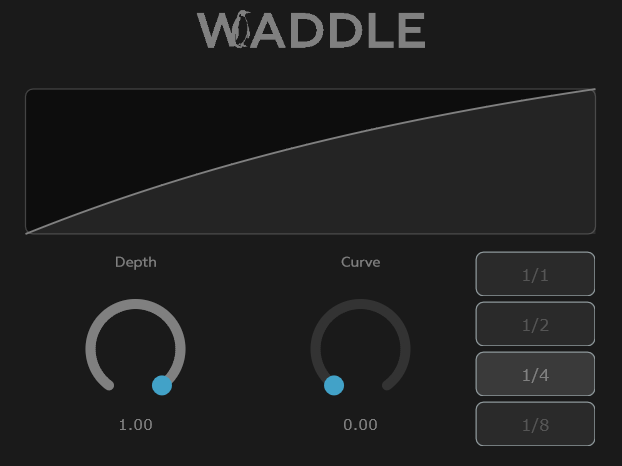

# Waddle

Made by Maxence Marchand, 2026

## What is Waddle ?

Waddle is a small VST3 plugin for sidechaining. Drop it into a mixer track, tweak the parameters to your liking, and enjoy the magic.

## How do I install it ?

Just download the [ZIP file](https://github.com/mxncmrchnd/waddle/releases/download/v1.0.0/Waddle.vst3.zip) and unzip it to the destination of your choice. Then make your DAW point towards that folder.

## How does it work ?

**Depth** : how much the volume ducks

**Curve** : how fast the volume gets back to its original level

**Rate** : 1/1, 1/2, 1/4 or 1/8, the frequency of the sidechain (default : 1/4)

## Dependencies

Plugin built with [Juce](https://juce.com/).