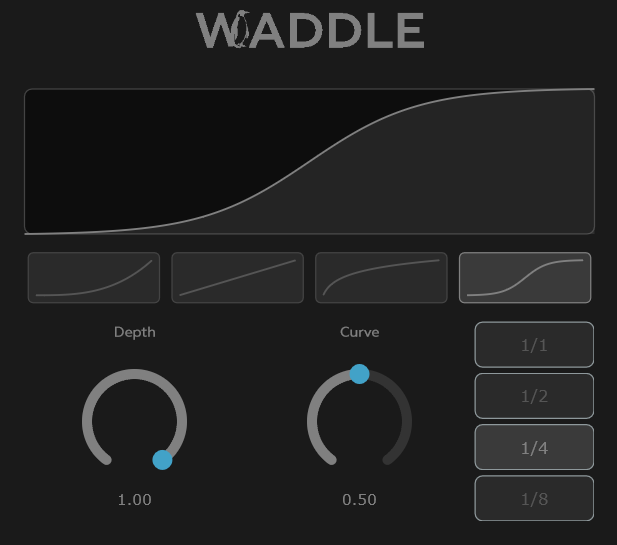

# Waddle


Waddle is a small VST3 plugin for sidechaining, made by Maxence Marchand, 2026.


## Summary

- [Installation](#installation)
    - [Direct download](#direct-download)
    - [Build from source](#build-from-source)
- [Requirements](#requirements)
- [Features](#features)
- [Demo project](#demo-project)
- [Dependencies](#dependencies)
- [License](#license)

## Installation

### Direct download

Download if from the [latest release](https://github.com/mxncmrchnd/waddle/releases/download/v1.1.0/Waddle.vst3.zip), and drop the `Waddle.vst3` folder to your location of choice.

### Build from source

```bash
git clone https://github.com/mxncmrchnd/waddle.git
cd waddle
cmake -B build -DJUCE_DIR=path/to/JUCE
cmake --build build --config Release
```
 
The built plugin will be at `build/Waddle_artefacts/Release/Waddle.vst3`.

## Requirements
 
- Windows 10 or later
- A VST3-compatible DAW (FL Studio, Ableton, Reaper, etc.)

## Features



**Wave type** : the type of envelope (exponential, linear, logarithmic or sine)

**Depth** : how much the volume ducks

**Curve** : how fast the volume gets back to its original level

**Rate** : 1/1, 1/2, 1/4 or 1/8, the frequency of the sidechain (default : 1/4)

## Demo project

*work in progress*

## Dependencies
 
- [JUCE 8](https://juce.com)
- [Visual Studio Build Tools](https://visualstudio.microsoft.com/visual-cpp-build-tools) with Desktop development with C++
- CMake 3.22+

## License

Waddle is licensed under the [GPL v3](LICENSE) license, in compliance with the JUCE open source license.
